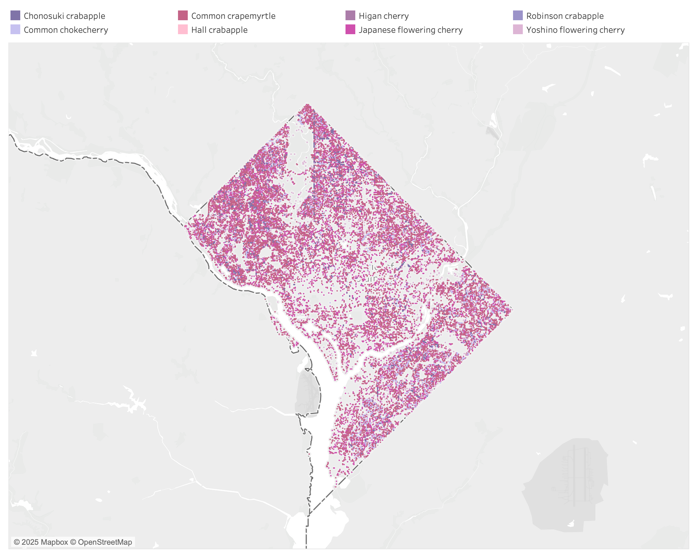
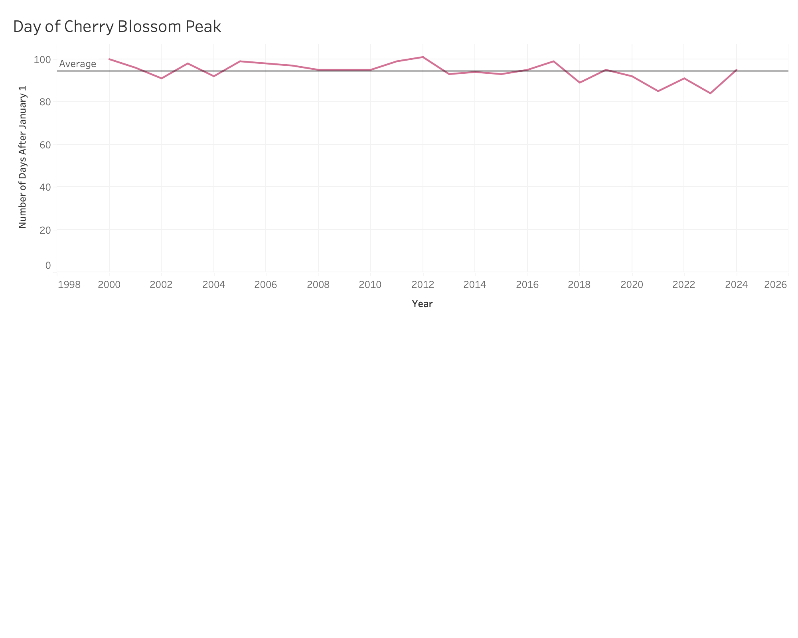

| [home page](https://cmustudent.github.io/tswd-portfolio-templates/) | [data viz examples](dataviz-examples) | [critique by design](critique-by-design) | [final project I](final-project-part-one) | [final project II](final-project-part-two) | [final project III](final-project-part-three) |

> Important note: this template includes major elements of Part I, but the instructions on Canvas are the authoritative source.  Make sure to read through the assignment page and review the rubric to confirm you have everything you need before submitting.  When done, delete these instructions before submitting.

# Outline
> ### High-level summary:
> #### Pretty pink flowers can be a powerful reminder about unity, peace, and mortality.
> Cherry blossom trees are typically 15-30 feet, live approximately 30 years, and are best known for their annual pink and white blooms. Native to Japan, cherry blossoms, called Sakura, are the national flower, and hold many meanings. They symbolize the dichotomy of the beauty of life and mortality--"As the coming of spring promises new life, so the blooming of cherry blossoms brings a sense of vitality and vibrancy. At the same time, their short lifespan is a reminder that life is fleeting" (Guide to Japan, 2025). Cherry blossom rituals in Japan can be traced back to Samurai warriors, and continue today.
>
> Washington, D.C. is also known for its abundance of cherry blossom trees, originally planted in the early 1900s. The idea to bring cherry blossoms to D.C. was introduced by a world traveler, Mrs. Eliza Ruhamah Scidmore, after a trip to Japan. After decades of peristance, in 1909, a letter Eliza wrote to first lady Helen Herron Taft finally led to action. Mrs. Taft had visited Japan and knew of the beauty of cherry trees, and took up the project. After hearing of her plans to plant trees along the avenue of the potomac, the Japanese consul offered a donation of an additional 2,000 trees given in the name of the City of Toyko. In 1912, after an unfortunate mishap with the first shipment of trees, a second shipment of 3,020 from 12 varieties arrived in Seattle from Japan. The trees were planted around the Tidal Basin. The took 7 years!
> 
> Not long after the first cherry blossom trees donated by Japan were planted, relations between the two countries became contentious. Still the trees lived on. Following WWII, Japan continued to donate trees as a symbol of ongoing diplomacy.
>
> Today, cherry blossom season is still one of the most significant periods of tourism each year, both in Japan and in Washington D.C. In D.C. they draw over a million visitors each year, and are one of the most distinguishing features of the city. Each spring, the cherry blossom festival offers community events and celebrations around the city. There is a strong local community surrounding cherry blossoms as well. Last year, the removal of one tree, lovingly called 'Stumpy' gave rise to protests and city-wide mourning.
>
> For those looking for beauty in every day life, or wishing to experience the diplomatic power of flowers, visit the cherry blossoms. Keep in mind some tips! Photographers like to visit the trees with the light of sunrise, when there are (slightly) fewer people around and the city is quiet. Weekends during peak season are really busy! Public transit is recommended over driving. And peak season is getting earlier and earlier each year due to climate change, so keep in mind that preserving the cherry blossoms might be more difficult in years to come. 
>
> ### Bulleted outline:
> - Cherry blossoms are trees that bloom each spring
> - Cherry blossom trees are very beautiful
> - Cherry blossoms originated in Japan in the Heian period (794-1185)
>   - They have sacred meaning
>   - They continue to bloom each year in Japan - famous trees include - X, Y, Z
> - Washington D.C. is also known for its cherry blossom trees, originally planted in the early 1900s.
>   - Idea was introduced by world travelor and advocate, Mrs. Eliza Ruhamah Scidmore, after her first trip to Japan
>   - After decades of persistance, the first lady of the United States Helen Herron Taft took up the project in 1909. She was familiar with the trees because she had visited Japan
>   - Trees were donated by the city of Tokyo and planted around the tidal basin in DC over the course of 7 years
>   - Not long after, U.S. and Japan relations grew contentious due to WWII. Still, the trees lived on. Following the war, they continue to serve as a symbol of diplomacy and unity.
> - Today, Cherry Blossom season is still one of the most significant periods of tourism each year, both in Japan and in Washington D.C.
>   - Popular visiting spots in Japan & Washington D.C. include...
>   - Other tips for flower-peeping include...
>   - A tribute to stumpy: a famous cherry blossom in D.C.
> - For those wondering about how to visit cherry blossoms during peak bloom...
>   - Cherry blossoms wait for no one - a powerful reminder to seize the opportunity to seek out beauty, even if it’s inconvenient
>   - Peak season is getting earlier and earlier each year, likely due to climate change
>   - Be wary of planning your trip too far out, you might miss them! Bloomwatch and forecasting may help!Cherry blossoms are beautiful and delicate pink flowers that bloom each spring.

## Initial sketches
>   ### DC Cherry Blossom Tree Location

>   ### Japan Cherry Blossom Peak - Historic

>   ### Japan Cherry Blossom Peak - 2000 to 2024

# The data
> - I plan to use data to show where cherry blossom trees are located in D.C. and also in Japan
> - I plan to use data to show the historic peak cherry blossom day / season
> - I plan to use data to show the places in D.C. that are common tourist locations (i.e. monuments) in relation to cherry blossoms

> - Google Drive link to Datasets: https://drive.google.com/drive/u/2/folders/1u0vidbJgvb_zP4OXIm2h0pvdps3WKv1WA

| Name | URL | Description |
|------|-----|-------------|
| DC Forestry     |  https://dcgis.maps.arcgis.com/apps/Nearby/index.html?appid=11cadab2140e475f89ddf5162f2d4108   |   Map of cherry blossom trees located in the District of Columbia, by type          |
| Historic Cherry Blossom Peak Dates    | https://ourworldindata.org/grapher/date-of-the-peak-cherry-tree-blossom-in-kyoto?facet=none     | Date of peak cherry blossom season in Japan, 812-2024            |
|      |     |             |

# Method and medium
> - I plan to use shorthand to create the webpage. 
> - I plan to use Tableau and/or datawrapper to create data visualizations. 

## References
- [_Cherry Blossom Watch._](https://cherryblossomwatch.com/stumpy/)
- [_Japan Travel Guide._](https://www.jal.co.jp/ar/en/guide-to-japan/experiences/cherry-blossom/what-do-cherry-blossoms-represent/index.html)
- [_National Parks Service._](https://www.nps.gov/featurecontent/cherryblossom/history-of-the-cherry-trees.html)
- [_National Cherry Blossom Festival._](https://nationalcherryblossomfestival.org/all-events/)

## AI acknowledgements
N/A
