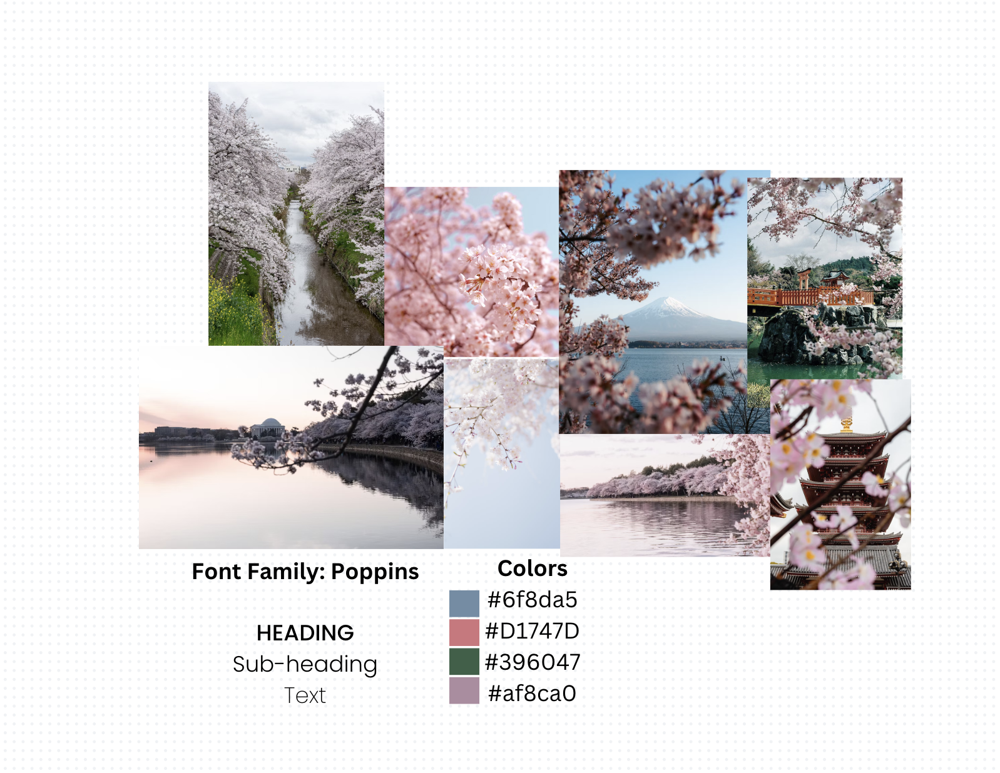

| [home page](https://cmustudent.github.io/tswd-portfolio-templates/) | [data viz examples](dataviz-examples) | [critique by design](critique-by-design) | [final project I](final-project-part-one) | [final project II](final-project-part-two) | [final project III](final-project-part-three) |

# Wireframes / storyboards

#### Updated storyline / outline 

#### [Link to draft shorthand](https://preview.shorthand.com/Msym2wTfYJiSNrMG)

> #### Pretty pink flowers can be a powerful reminder about unity, peace, and mortality.
- Cherry blossom trees are typically 15-30 feet, live approximately 30 years, and are best known for their annual pink and white blooms. Native to Japan, cherry blossoms, known as Sakura, are the national flower.
- Sakura symbolize the contrast between the beauty of life and the inevitability of mortality. Cherry blossoms begin to bloom in late March, as the spring time nears and promises new life. When the buds are finally in full bloom, they bring vibrant energy and remind us of the beauty in nature. The blooms, however, only last about 1-2 weeks, leaving us with a powerful reminder about the fleeting nature of life.
- The allure of cherry blossom flowers is undeniable. When the trees are in bloom, they captivate visitors from near and far, inviting them to take a moment from their daily lives to admire their natural beauty. Today, one of the most popular places to marvel at the beauty of cherry blossom trees is amongst the ~38,000 trees planted in Washington, D.C. According to the U.S. Environmental Protection Agency's website, the annual Cherry Blossom Festival attracts approximately 1.5 million visitors each year.
- Beyond their beauty and symbolism, cherry blossoms have come to serve as a token of diplomacy. Beginning in the late 19th century, cherry blossoms have served as an ongoing symbol of friendship between Japan and the United States. The City of Tokyo donated the first set of trees to be planted in Washington D.C. The reciprocity of this friendship continued throughout the 20th century, and after World War II.
- The idea to bring cherry blossoms to D.C. was introduced by a world traveler, Mrs. Eliza Ruhamah Scidmore, after a trip to Japan.
  - After decades of persistence, a letter Eliza wrote to first lady Helen Herron Taft finally led to action. After hearing of her plans to plant trees along the avenue of the Potomac River, the river that flows through Washington D.C., the Japanese consul became involved in the project.
  - In coordination with Mayor of the city of Tokyo, the consul offered a donation of an additional 2,000 trees. In 1912, after an unfortunate mishap with the first shipment of trees, and additional coordination between the two cities, a second shipment of 3,020 trees from 12 varieties arrived in Seattle from Japan.
  - Trees were planted around the city, concentrated around the Tidal Basin. This process took over 7 years! The original source of Washington D.C.'s tree seedlings, a grove along the Arakawa river outside of Tokyo, was lost during WWII. Japan asked for help to restore the grove.
  - The U.S. National Park Service shipped seedlings from descendants of the original trees back to Tokyo.

- For those looking for beauty in every day life, or wishing to experience the diplomatic power of flowers, visit the cherry blossoms when they are in full bloom. Today, cherry blossom season is still one of the most significant periods of tourism each year, both in Japan and in Washington D.C.
- In Washington D.C., the cherry blossom festival offers community events and celebrations around the city. Public transit is recommended over driving. Seek spots to see the cherry blossoms near a national monument during your tour of D.C. One great spot to visit is the National Arboretum.
- In Japan, the trees are located across the entire country. Depending where you visit, the peak will be at a different time in the season.
- Some more general tips and information, regardless of where you go:
  - Peak season is getting earlier and earlier each year due to climate change, so keep in mind that preserving the cherry blossoms might be more difficult in years to come. There are also concerns over flooding that could impact the trees' longevity.
  - Photographers like to visit the trees with the light of sunrise, when there are (slightly) fewer people around
- Be wary of planning your trip too far out, you might miss them! Bloomwatch and forecasting may help! 

#### [Link to draft shorthand](https://preview.shorthand.com/Msym2wTfYJiSNrMG)

# User research 

#### Target audience
- Individuals who haven't visited Washington D.C., or who haven't visited during cherry blossom season
- Individuals who enjoy traveling and are looking for recommendations, tips, tricks!

#### Interview script
> List the goals from your research, and the questions you intend to ask.
- I shared my draft website with colleagues during class, and sourced their feedback. My main goals for the feedback sessions are listed below, along with insights gained. 

#### Interview Goals
- Assess whether the flow of the story is logical, confusing, and if there are any points that don't fit well or aren't less interesting
  - _Planned Questions:_
    - What do you think the call to action for this story is?
    - What about the story is interesting, boring, exciting?
    - What confused you? Were there parts that were difficult to understand?
- Assess the design choices made (color, presentation methods, data visualizations)
- _Planned Questions:_
    - Did the design flow well? Were there elements that seemed disjoint from the rest of the design?
    - How would you describe the design, color choices, presentation method? Was it fun, casual, formal, etc.?

#### Interview findings

| Interviews on 2/17 (with 3 peers) | Interview 2 | Interview 3 |
|-------------------------|--------------------------------|-------------|-------------|
| My peers shared a few insights that were really helpful for me and will inform my next project iteration. They also validated many of the design decisions (e.g. colors, layout of the timeline) I made but was originally unsure about, which helped me to be more confident in these decisions. Some of the constructive feedback included: 1) Data visualizations appear later in the story, but maybe could be included sooner / earlier, 2) It can be difficult to visually quantify some of the numbers used in the story (e.g. how many is 20,000 trees?). The story could be more powerful if this is put into context, 3) The story could be more tailored to tourists if the idea is introduced sooner and more data provided. |             |             |
|                                |             |             |
|                                |             |             |

#### Identified changes for Part III
I anticipate incorporating the below changes in the coming week. 

| Research synthesis                       | Anticipated changes for Part III                                                |
|------------------------------------------|---------------------------------------------------------------------------------|
| Data visualizations appear later in the story, but maybe could be included sooner / earlier | Introduce tourism earlier in the story, including descriptive stats about the number of tourists each year |
| It can be difficult to visually quantify some of the numbers used in the story (e.g. how many is 20,000 trees?). The story could be more powerful if this is put into context | Show a visualization of a forest to help put this into perspective visually |
| The story could be more tailored to tourists if the idea is introduced sooner and more data provided.| Similar to the first item, introduce tourism earlier in the story, and incorporate more detail about tourism throughout, especially with specific travel tips |
|                                          |                                                                                 |
| ...add more rows as necessary            |                                                                                 |

# Moodboards / personas
Here's a quick 'moodboard' I created in Canva!

## References
- Goranson, Chris, Course Materials - Telling Stories with Data Spring 2025
- [_Cherry Blossom Watch._](https://cherryblossomwatch.com/stumpy/)
- [_Japan Travel Guide._](https://www.jal.co.jp/ar/en/guide-to-japan/experiences/cherry-blossom/what-do-cherry-blossoms-represent/index.html)
- [_National Parks Service._](https://www.nps.gov/featurecontent/cherryblossom/history-of-the-cherry-trees.html)
- [_National Cherry Blossom Festival._](https://nationalcherryblossomfestival.org/all-events/)
- [Britannica](https://www.britannica.com/biography/Helen-Taft)

## AI acknowledgements
- I used ChatGPT 4-o mini to assist with HTML editing for data visualization embeddings. Link to chat: https://chatgpt.com/share/67b4e11d-b1f8-8010-acbb-b016566e3148

